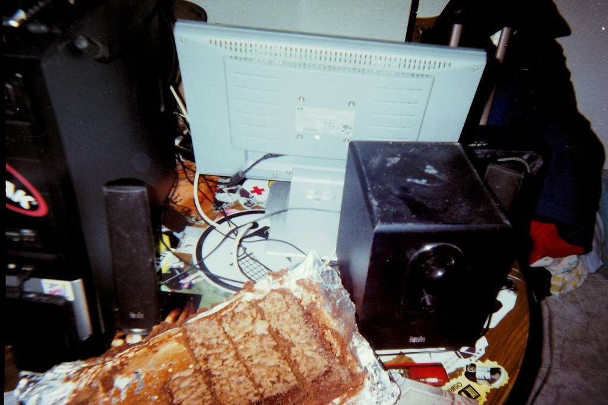

# Pastelería Uba 🥧
Esta es una práctica de introducción FrontEnd de [LaunchX](https://github.com/LaunchX-InnovaccionVirtual), la práctica consiste en hacer la maquetación HTML para las páginas del cliente y pastero; más información [aquí](https://github.com/LaunchX-InnovaccionVirtual/FrontEnd-Mision/tree/main/02%20-%20HTML/practicas) 
